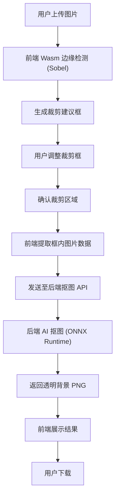

## 1. 产品概述

一款基于 Web 的智能抠图工具，利用 Rust/Wasm 在前端实时执行边缘检测，帮助用户精准定位图片主体，再由后端 AI 服务完成高质量抠图，实现"上传→检测→裁剪→抠图→下载"的完整工作流。

- **核心价值**：前端轻量计算保证实时交互体验，后端重计算保证抠图质量，分工明确、用户操作流畅
- **目标用户**：设计师、电商运营、内容创作者等需要快速去除图片背景的用户

## 2. 核心功能

### 2.1 用户角色
| 角色 | 注册方式 | 核心权限 |
|------|----------|----------|
| 普通用户 | 无需注册 | 上传图片、边缘检测、调整裁剪框、抠图、下载 |

### 2.2 功能模块
1. **工作台页面**：图片上传、边缘检测预览、裁剪框调整、抠图结果展示、下载

### 2.3 页面详情
| 页面名称 | 模块名称 | 功能描述 |
|----------|----------|----------|
| 工作台 | 图片上传区 | 拖拽或点击上传图片，支持 JPG/PNG/WebP 格式 |
| 工作台 | 边缘检测预览 | 调用 Wasm 模块执行 Sobel 边缘检测，实时叠加显示轮廓 |
| 工作台 | 裁剪框交互 | 根据轮廓自动生成建议框，用户可拖拽调整位置和大小 |
| 工作台 | 抠图操作 | 将裁剪框内图片数据发送至后端，调用 AI 抠图服务 |
| 工作台 | 结果展示 | 展示透明背景 PNG，支持棋盘格背景预览 |
| 工作台 | 下载 | 一键下载透明背景 PNG 图片 |

## 3. 核心流程

用户上传图片 → 前端 Wasm 边缘检测生成轮廓 → 自动生成裁剪建议框 → 用户手动调整框位置/大小 → 确认后将框内图片发送至后端 → 后端 AI 抠图 → 返回透明 PNG → 前端展示并支持下载

## 4. 用户界面设计

### 4.1 设计风格
- **主色调**：深色科技风 — 深灰 (#0D0D0D) 背景 + 青色 (#00E5CC) 强调色
- **辅助色**：白色文字 + 灰色 (#3A3A3A) 边框
- **按钮风格**：圆角矩形，青色主按钮，深灰次按钮，hover 时发光效果
- **字体**：标题使用 Space Grotesk，正文使用 DM Sans
- **布局风格**：左右分栏 — 左侧图片操作区，右侧控制面板
- **图标风格**：线条图标 (Lucide)

### 4.2 页面设计概览
| 页面名称 | 模块名称 | UI 元素 |
|----------|----------|----------|
| 工作台 | 图片上传区 | 虚线边框拖拽区，拖入时发光动画，中央上传图标+文字 |
| 工作台 | 边缘检测预览 | Canvas 叠加层，半透明青色轮廓线，原图与轮廓切换按钮 |
| 工作台 | 裁剪框 | 虚线矩形框，四角拖拽手柄，拖拽时显示尺寸标注 |
| 工作台 | 控制面板 | 检测灵敏度滑块、重检测按钮、确认裁剪按钮、抠图按钮 |
| 工作台 | 结果展示 | 棋盘格背景 + 透明 PNG，缩放控制，下载按钮 |

### 4.3 响应式设计
- 桌面端优先，左右分栏布局
- 平板端自动切换为上下布局
- 移动端单列布局，控制面板折叠为底部抽屉

### 4.4 3D 场景指导
- 不涉及 3D 场景
