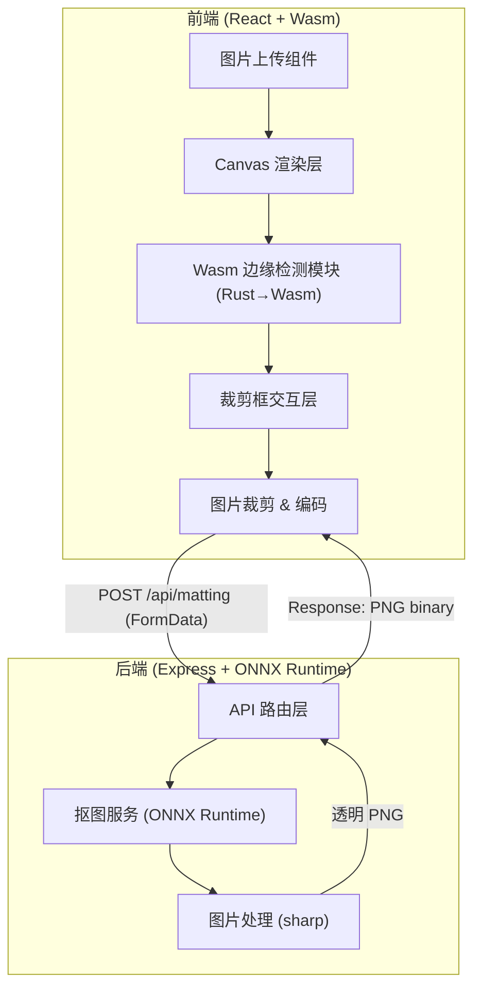
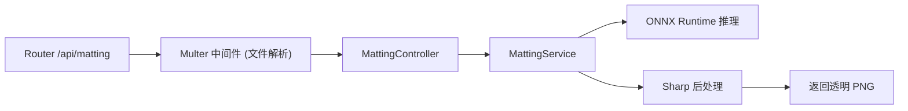

## 1. 架构设计



## 2. 技术说明

- **前端**：React@18 + TypeScript + Tailwind CSS + Vite
- **Wasm 模块**：Rust 编写 Sobel 边缘检测算法，编译为 Wasm，通过 wasm-pack 打包，前端以 ES Module 方式引入
- **后端**：Express@4 + TypeScript + multer (文件上传) + sharp (图片处理)
- **AI 抠图**：ONNX Runtime (onnxruntime-node) 加载 U2Net 或 MODNet 模型；若无模型文件则使用模拟抠图服务（基于色彩差异的简易 alpha 估计）
- **初始化工具**：vite-init (react-express-ts 模板)
- **数据库**：无（无需持久化存储）

## 3. 路由定义

| 路由 | 用途 |
|------|------|
| `/` | 工作台主页面 |

## 4. API 定义

### 4.1 抠图接口

**POST /api/matting**

Request:
- Content-Type: `multipart/form-data`
- Body: `image` (File) — 裁剪后的图片文件

Response (成功):
- Content-Type: `image/png`
- Body: 透明背景 PNG 图片二进制数据

Response (失败):
- Content-Type: `application/json`
- Body:
```typescript
interface MattingError {
  error: string;
  message: string;
}
```

### 4.2 健康检查

**GET /api/health**

Response:
```typescript
interface HealthResponse {
  status: "ok";
  onnxReady: boolean;
}
```

## 5. 服务器架构图



## 6. 数据模型

### 6.1 前端状态模型 (Zustand)

```typescript
interface AppState {
  originalImage: HTMLImageElement | null;
  edgeMap: Uint8Array | null;
  cropRect: { x: number; y: number; width: number; height: number } | null;
  resultImage: string | null;
  status: "idle" | "uploading" | "detecting" | "cropping" | "matting" | "done" | "error";
  sensitivity: number;
}
```

### 6.2 Wasm 模块接口

```typescript
interface WasmEdgeDetector {
  detect_edges(image_data: Uint8Array, width: number, height: number, threshold: number): Uint8Array;
}
```
